# Clonar el repositorio
git clone https://github.com/fsteven96/Formularios.git

# Ejecutar el script SQL en el servidor de base de datos
Asegúrate de ejecutar el script 'FormDB.sql' para crear la base de datos.
El script se encuentra en la raíz del proyecto.
Usa SQL Server Management Studio o cualquier otra herramienta compatible.

#Configurar la cadena de conexión en appsettings.json:
"ConnectionStrings": {
   "DefaultConnection": "Server=[Pon el nombre de Tu servidor];Database=FormDB;Trusted_Connection=True;MultipleActiveResultSets=true;TrustServerCertificate=True"
 }

# Backend
cd Formularios/DynamicFormsAPI
dotnet restore
dotnet ef database update
dotnet run

# Frontend
cd Formularios/dynamic-forms-frontend
npm install
npm start

# Funcionalidades
Visualización de formularios – Lista de formularios creados con opciones para Agregar, editar, elimnar, vista previa y ver resultados.
Creación de formularios – Generación de nuevos formularios con distintos tipos de campos.
Edición de formularios – Modificación de formularios existentes.
Eliminacion de los formularios 
Ingreso de información – Captura de respuestas en los formularios creados.
Guardado de información – Almacenamiento de datos en SQL Server.
Consulta de respuestas – Visualización de respuestas ingresadas en los formularios.

## 📸 Evidencias  

### Listado de formularios  
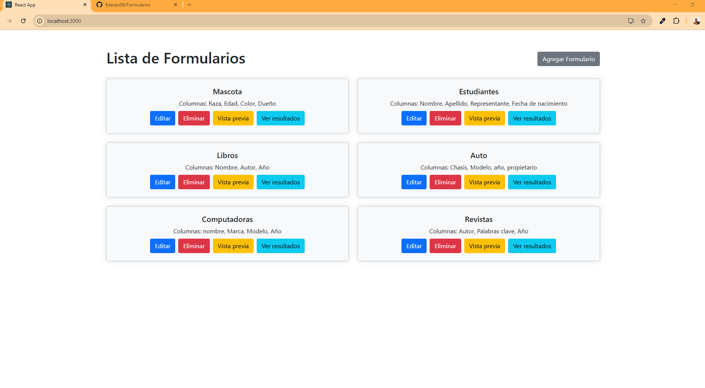  
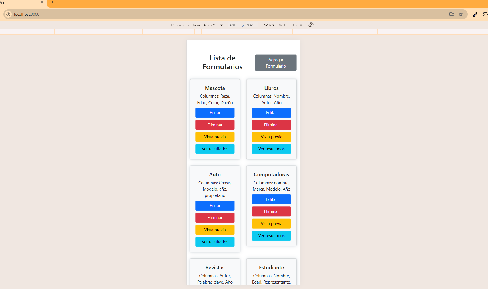  

### Creación de formularios  
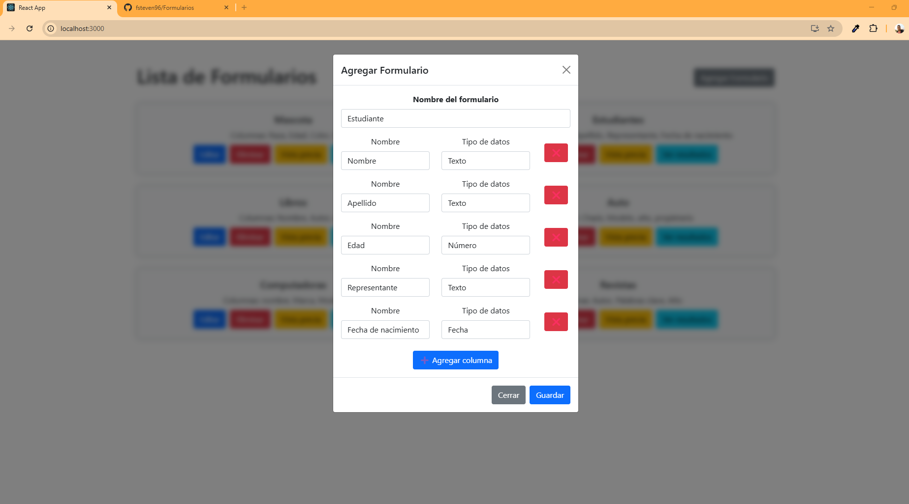  
  

### Edición de formularios  
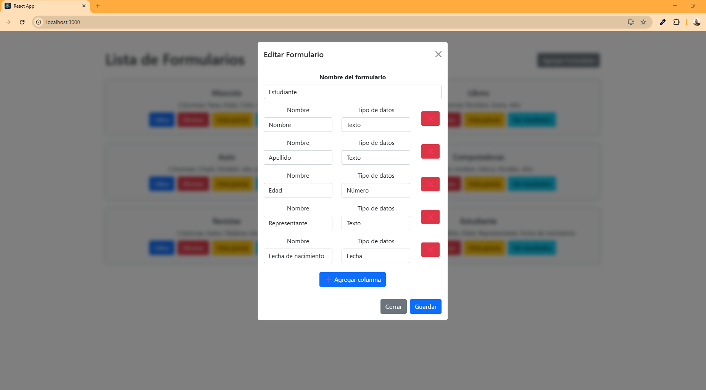  
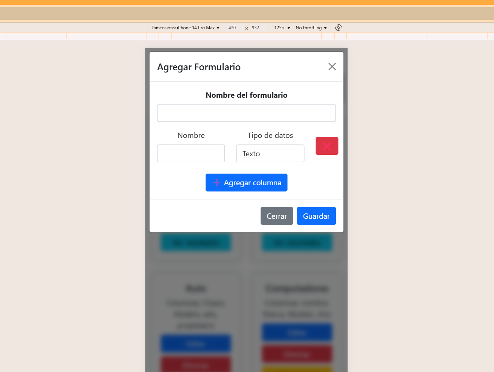  

### Eliminación de formularios  
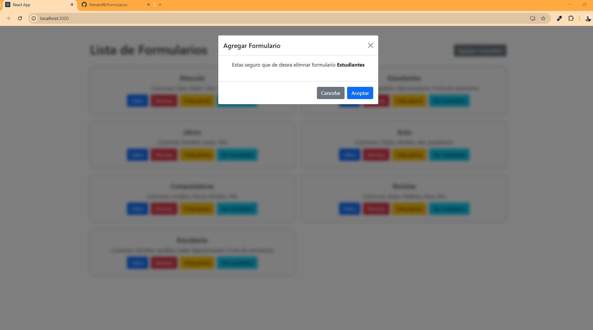  
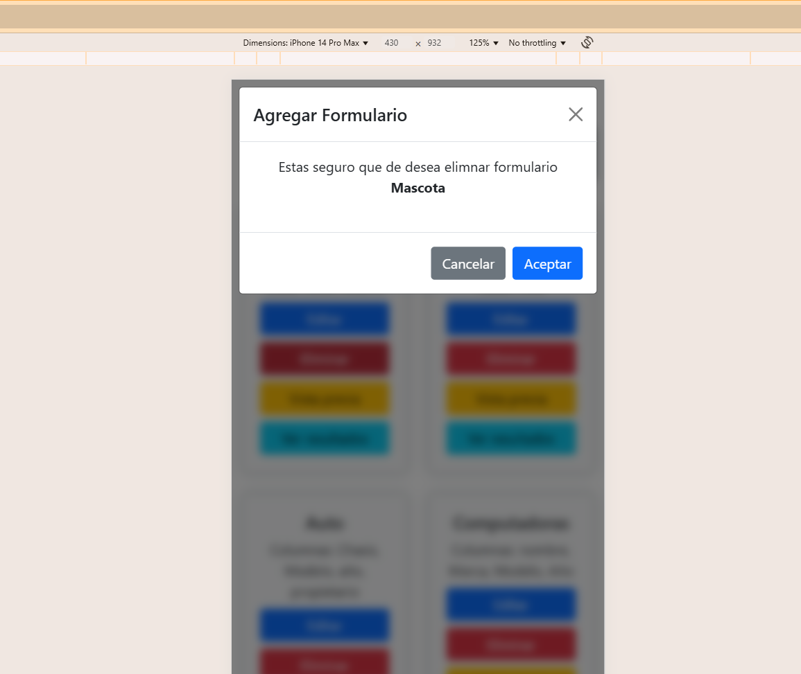  

### Creación de campos (inputs) de un formulario  
  
 

### Ingreso de información en un formulario (extra)  
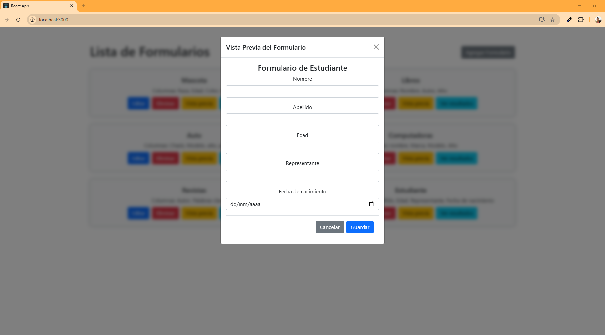  
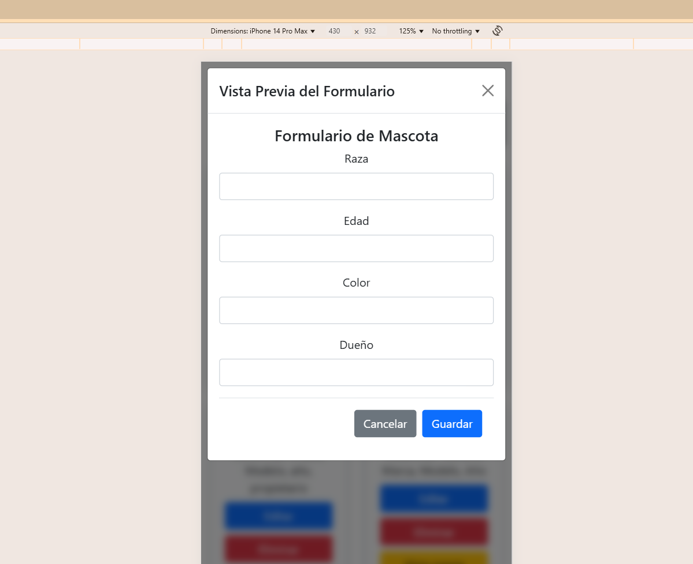  

### Consulta de información de un formulario (extra)  
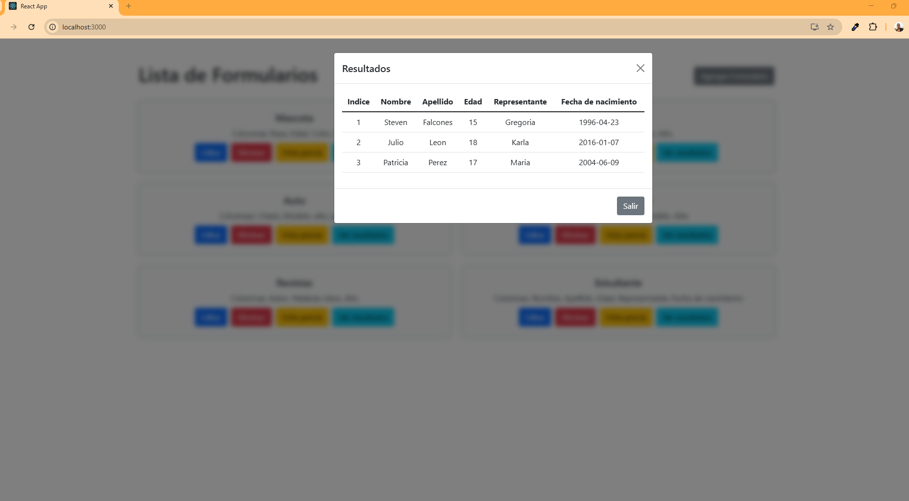  
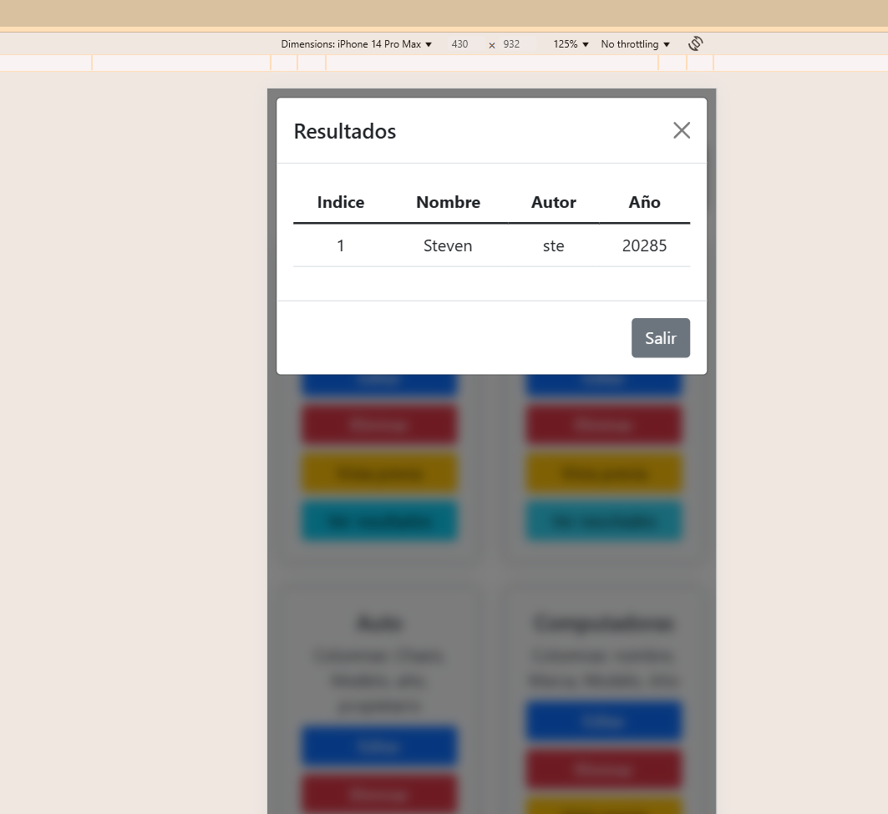  
